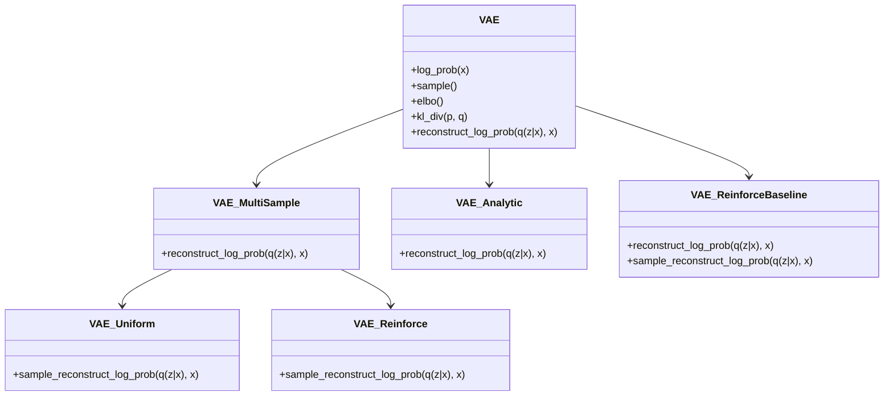

```mermaid
classDiagram
    class VAE{
        +log_prob(x)
        +sample()
        +elbo()
        +kl_div(p, q)
        +reconstruct_log_prob(q(z|x), x)
    }
    class VAE_MultiSample{
        +reconstruct_log_prob(q(z|x), x)
    }
    class VAE_Analytic{
        +reconstruct_log_prob(q(z|x), x)
    }
    class VAE_Uniform{
        +sample_reconstruct_log_prob(q(z|x), x)
    }
    class VAE_Reinforce{
        +sample_reconstruct_log_prob(q(z|x), x)
    }
    class VAE_ReinforceBaseline{
        +reconstruct_log_prob(q(z|x), x)
        +sample_reconstruct_log_prob(q(z|x), x)
    }
    VAE --> VAE_Analytic
    VAE --> VAE_MultiSample
    VAE_MultiSample --> VAE_Uniform
    VAE_MultiSample --> VAE_Reinforce
    VAE --> VAE_ReinforceBaseline
```
