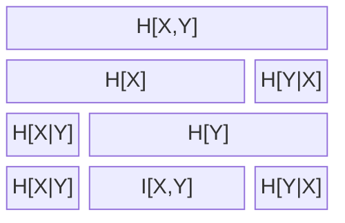

# Information Theory

Reference:
figure 9.1, p. 149, David Mackay, Information Theory, Inference, and Learning Algorithms.

# Entropy

$$
H[X] = E_{X \sim p(X)}[log p(X)]
$$

# Kullback Leibler Divergence

$$
D_{KL}[p(x) || q(x)] = E_{X \sim p(x)[log p(x) - log q(x)]
$$

# Mutual Information

Mutual Information is defined as:

$$
I(X,Y) \equiv D_{KL}[p(x,y)||p(x) p(y)]
$$

equivalantly:

$$
I(X,Y) \equiv E_{(x,y) \sim p(x,y)}[log(\frac{p(x,y)}{p(x) p(y)})]
$$

## References
Pattern Recognition and Machine Learning (2006), Christopher Bishop, p57, equ 1.120
