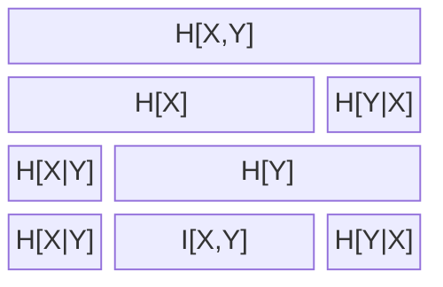

```mermaid
block-beta
columns 4
a["H[X,Y]"]:4
b["H[X]"]:3 c["H[Y|X]"]:1
d["H[X|Y]"]:1 e["H[Y]"]:3
f["H[X|Y]"]:1 g["I[X,Y]"]:2 h["H[Y|X]"]:1
```

Reference:
figure 9.1, p. 149, David Mackay, Information Theory, Inference, and Learning Algorithms.
